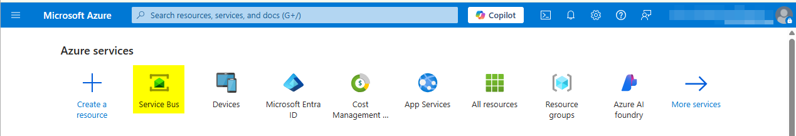
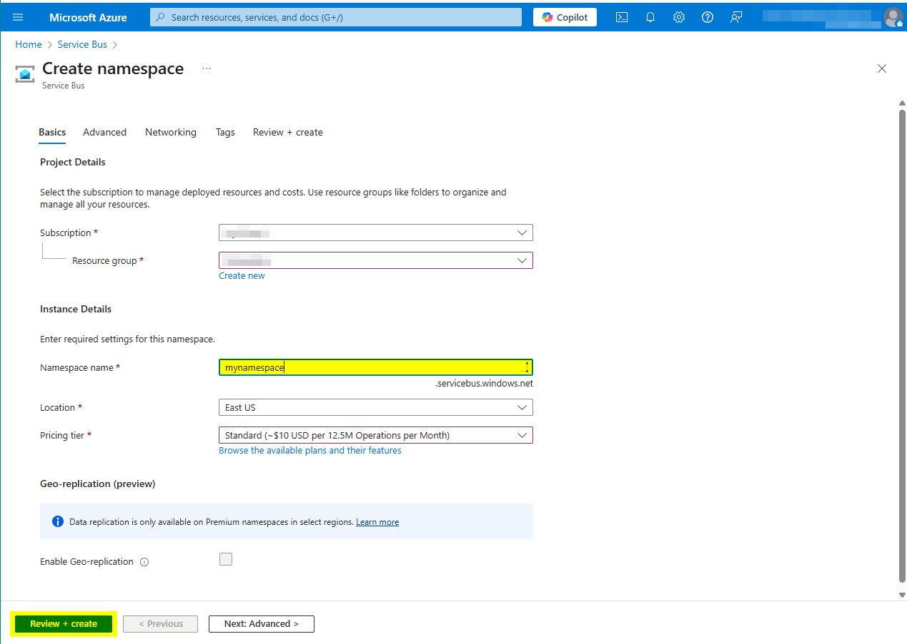
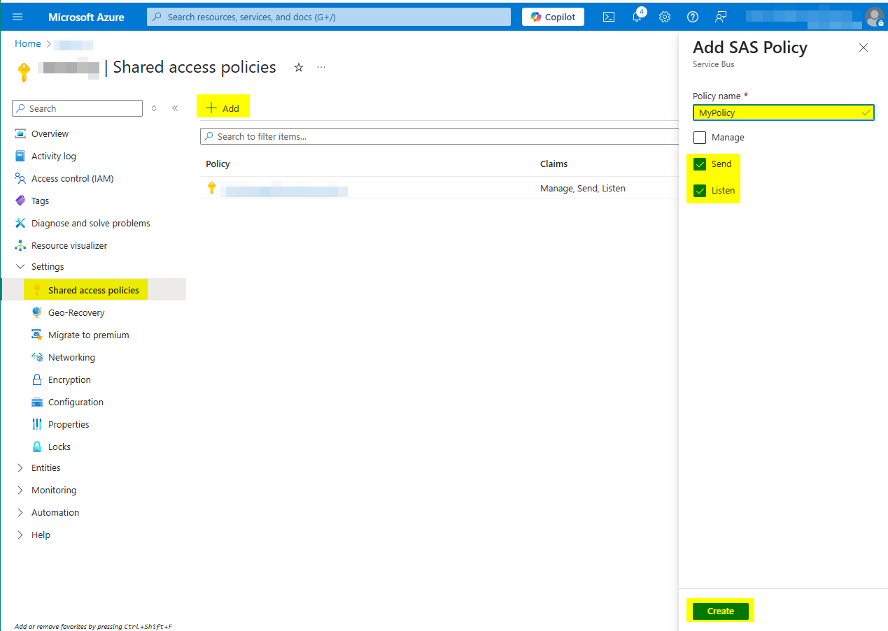
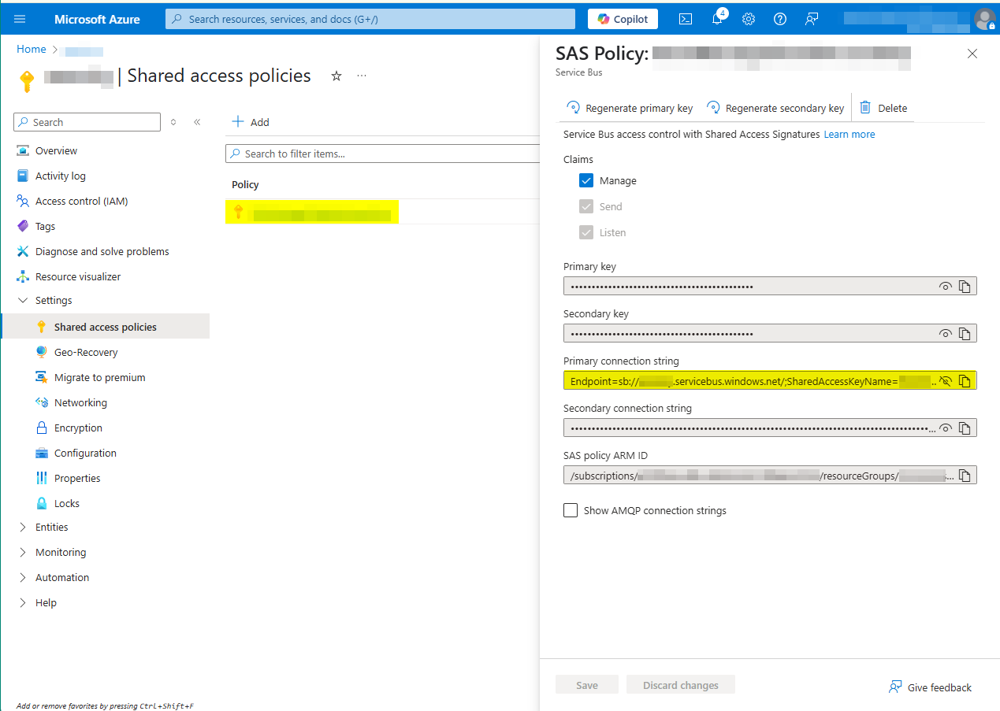
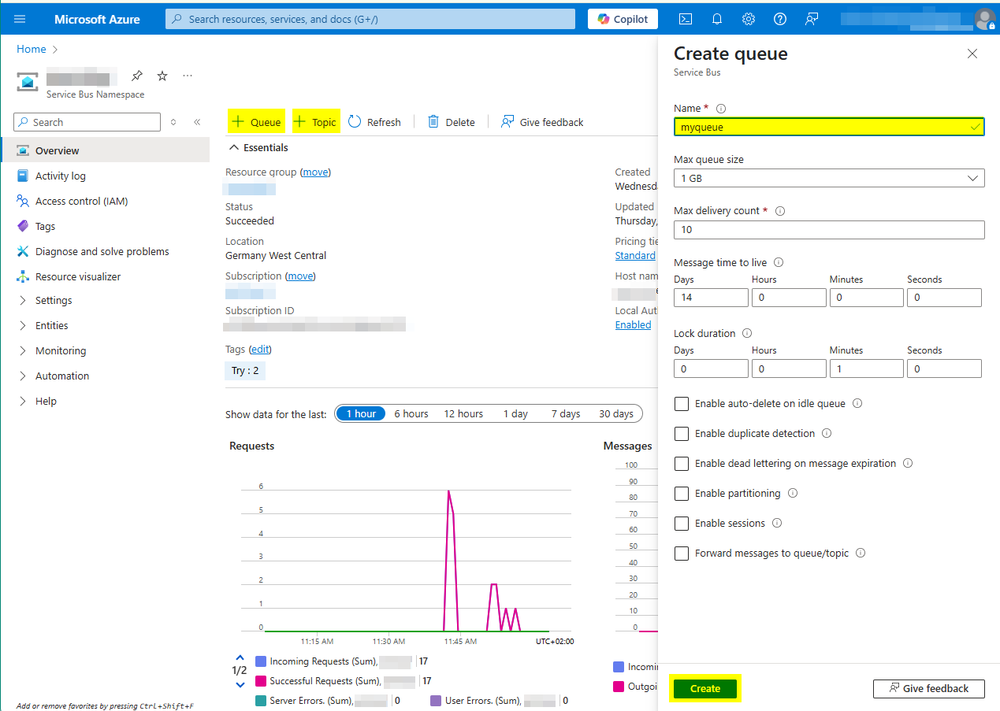
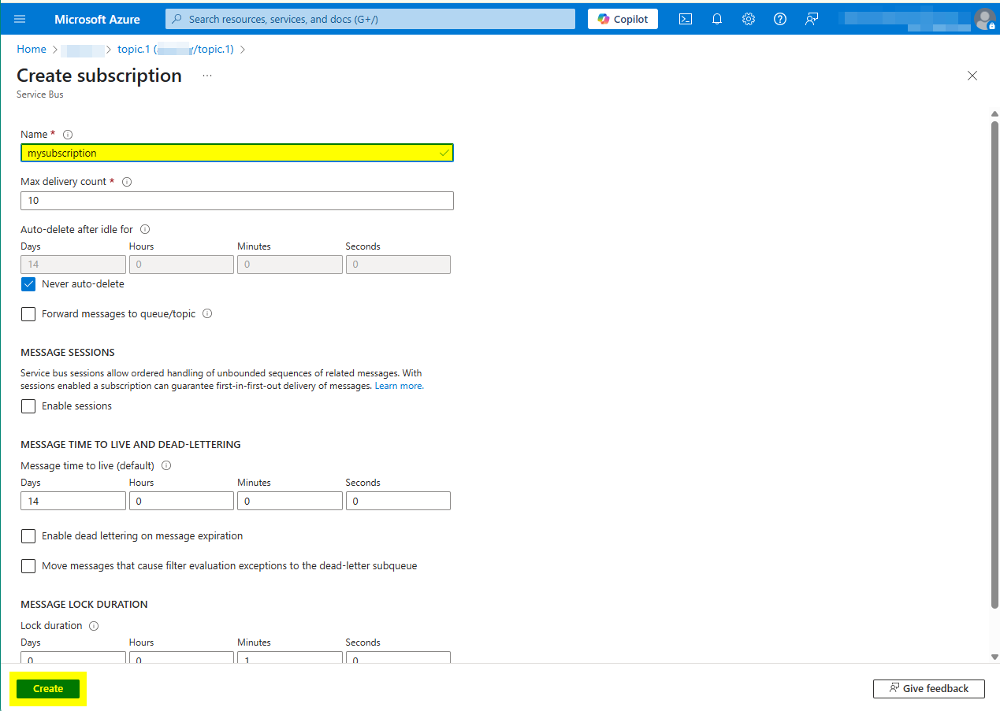

# Azure Service Bus Connector

Connect to the [Azure Service Bus](https://azure.microsoft.com/products/service-bus/).

This connector gives you access to the Azure Service Bus. It allows to
define multiple sending and receiving connections to queues and topics.

Additionally, this connector provides an `IProcessStartEventBean` which
can be used to start Ivy processes which react on Azure Service Bus
messages.

## Demo

The demo provides a dialog with buttons for sending and receiving messages
for different configurations.

To see the effect of sending messages you have multiple options. In the GUI
use the button to receive a maximum number of messages from a configuration
within a max wait time.

### AzureServiceBusStartEventBean

The demo also contains examples of using an `AzureServiceBusStartEventBean`.
In the Demo, the bean will listen for configuration `queue2` and simply
log the message in the run-time log.

### Other tools

Use the Azure Servie Bus Explorer in the Azure Portal to see and send messages.

## Setup

Unpack the demo project to adapt all values described below.

You can test the connector with the official
[Azure Service Bus Emulator](https://github.com/Azure/azure-service-bus-emulator-installer)
or directly in the Azure Service Portal.

### Azure Service Bus Emulator

- Start by cloning the repository https://github.com/Azure/azure-service-bus-emulator-installer
- In the file `ServiceBus-Emulator\Config\Config.json` copy the block of `queue.1` and create another queue named `queue.2` (used to demonstrate automatic receive of messages) in the list of queues.
- Change directory to `Docker-Compose-Template`
- Create a file named `.env` with the following content:

```
SQL_PASSWORD=AxonIvy-2025
ACCEPT_EULA=y
SQL_WAIT_INTERVAL=15
CONFIG_PATH=..\ServiceBus-Emulator\Config\Config.json
```

Start docker compose from the same directory.

`docker compose -f .\docker-compose-default.yml up -d`

Configure the connection in your global variables `demo` section with
`connectionString: 'Endpoint=sb://localhost;SharedAccessKeyName=RootManageSharedAccessKey;SharedAccessKey=SAS_KEY_VALUE;UseDevelopmentEmulator=true;'`

### Azure Service Portal

The demo is configured to work with two queues (`queue.1`, `queue.2`) and one topic (`topic.1`) with a subscription
name `subscription.3` (to match the example setup in the service bus emulator). To run the demo with the real Azure Service Bus, you can either chage the global variables to match your queues and topics, or you can quickly create your own example setup, following these steps:

Start the [Azure Portal](https://portal.azure.com) and open the Service Bus management section.

Create a namespace.

Add a SAS policy to your namespace with Send and Listen permissions.

Note the connection string.

Create the needed queues and topics.

Create subscriptions for your topics.


Configure the `connectionString` (or `fullyQualifiedName`) in the `demo` section of
global variables.

For more information about the Azure Service Bus please see the official documentation
at [https://learn.microsoft.com/de-at/azure/service-bus-messaging/](https://learn.microsoft.com/de-at/azure/service-bus-messaging/).

## Usage

The connector currently supports connecting with a `connectionString` or with the
`fullyQualifiedName` and a `DefaultAzureCredentialBuilder`. Both values can be
configured for every configuration. If you want to share this configuration between
multiple queues or topics, it is a good idea to create a base configuration and
`inherit` from it in other places. Please see the Azure documentation for a description
of these methods.

The connector provides simple send and receive methods and automatically creates senders
and receivers based on global variables configuration.

If any special configuration is needed, please implement an `AzureServiceBusSenderSupplier`
which creates a sender or an `AzureServiceBusReceiverSupplier` which creates a receiver.
You might want to look into the `AzureServiceBusService` to see how this is done.
Senders and receivers created in by Suppliers are identified by a configuration name and
will be cached and re-used in the same way as their simple counterparts.
To create a specific processor, you should extend the provided `AzureServiceBusStartEventBean`
and override the function `createProcessor`.

### AzureServiceBusStartEventBean

An `AzureServiceBusStartEventBean` for use in an Ivy *Program start* element is provided to listen
on configurations and start Ivy processes. Select this bean in the *Start* tab of a *Program start*
element.

Configure the configuration name to use for the processor in the *Editor* tab of the *Program start* element:

### Configuration

Configuration can be done in global variables where some simple inheritence mechanism
is provided. All Azure Service Bus configuration is stored below the `azureServicebusConnector` global
variable. See the variable descriptions for usage.


```
@variables.yaml@
```
