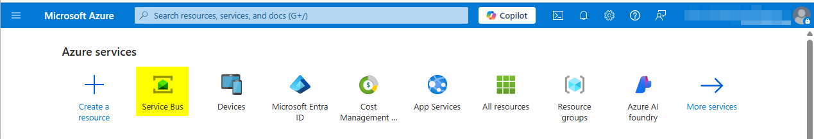

# Himmelblauer Bedienung Bus Anschluss

Koppel zu das [Himmelblauen Bedienung
Bus](https://azure.microsoft.com/products/service-bus/).

Dieser Anschluss gibt du greifst zu zu der Himmelblauen Bedienung Bus. Es
erlaubt zu definieren mehrfaches #Senden und empfangend Zusammenhänge zu Reihen
und Gegenstände.

Außerdem, dieser Anschluss versieht ein `IProcessStartEventBean` welcher kann
sein benutzt zu starten #Ivy verarbeitet #welche reagiert auf Himmelblau
Bedienung Bus Meldungen.

## Demo

Die Demo versieht ein Zwiegespräch mit Knöpfe für senden und empfangend
Meldungen für verschieden Konfigurationen.

Zu sehen den Effekt von senden Meldungen du hast mehrfache Optionen. In die
#grafische Benutzeroberfläche Nutzung der Knopf zu empfangen eine #höchster
Nummer von Meldungen von einer Konfiguration #innerhalb einer max Wartezeit
Zeit.

### AzureServiceBusStartEventBean

Die Demo zügelt auch Beispiele von benutzen #ein
`AzureServiceBusStartEventBean`. In der Demo, die Bohne wollen für Konfiguration
zuhören `queue2` und einfach #loggen die Meldung in dem Lauf-#messen #loggen.

### Anderen Tools

Benutz das Himmelblaues Servie Bus Forscher in dem Himmelblauen Portal zu sehen
und senden Meldungen.

## Einrichtung

Pack aus das Demo Projekt zu adaptieren alle Werte beschrieben unten.

Du kannst den Anschluss mit dem Beamtem testen [Himmelblauen Bedienung Bus
Emulator](https://github.com/Azure/azure-service-bus-emulator-installer) oder
direkt in der Himmelblauen Bedienung Portal.

### Himmelblauer Bedienung Bus Emulator

- Start klonen mal das Aufbewahrungsort
  https://github.com/Himmelblaue/#Azur-Bedienung-Bus-Emulator-Installateur
- In der Datei `ServiceBus-Emulator\Config\Config.json` Kopiert den Block von
  `Reihe.1` und schaffen andere Reihe geheißen `Reihe.2` (benutzt zu
  demonstrieren automatisch empfangen von Meldungen) in der Liste von Reihen.
- Änderung Telefonbuch zu `Hafenarbeiter-Abfassen-Vorlage`
- Schaff eine Datei geheißen `.env` Mit dem folgenden Inhalt:

```
SQL_PASSWORD=AxonIvy-2025
ACCEPT_EULA=y
SQL_WAIT_INTERVAL=15
CONFIG_PATH=..\ServiceBus-Emulator\Config\Config.json
```

Start Hafenarbeiter fasst ab von ebensolchem gleichen Telefonbuch.

`Hafenarbeiter fasst ab -f .\Hafenarbeiter-abfassen-Vorgabe.yml Hin -d`

Konfigurier den Zusammenhang in euren globalen Variablen `Demo` Sektion mit
`connectionString:
'Endpunkt=sb://localhost;SharedAccessKeyName=RootManageSharedAccessKey;SharedAccessKey=#SAS_#EINTASTEN_WERT;UseDevelopmentEmulator=Wahr;'`

### Himmelblaues Bedienung Portal

Die Demo ist konfiguriert zu arbeiten mit zwei Reihen (`Reihe.1`, `Reihe.2`) und
eins Gegenstand (`Gegenstand.1`) mit einen Abonnement Namen `Abonnement.3` (zu
passen die Beispiel Einrichtung in den Bedienung Bus Emulator). Zu rennen die
Demo mit dem realen Azur Bedienung Bus, du kannst auch chage die globalen
Variablen zu passen eure Reihen und Gegenstände, oder du kannst schnell eure
eigenes Beispiel Einrichtung schaffen, folgend diese Stufen:

Starte das [Himmelblaues Portal](https://portal.azure.com) und offen den
Bedienung Bus Management Sektion. 
Schafft einen Namensraum. 
Fügt zu eine #SAS Richtlinie zu eurem Namensraum mit Senden und Zuhören
Erlaubnisse.  Beachtet
die Zusammenhang Schnur. 
Schafft die brauchte Reihen und Gegenstände.  Schaffen Abonnements für eure
Gegenstände. 

Konfigurier das `connectionString` (oder `fullyQualifiedName`) herein das `Demo`
Sektion von global Variablen.

Für #mehr Auskunft von der Himmelblauen Bedienung Bus sehen bitte die offizielle
Dokumentation an
[https://Lern.microsoft.com/de-An/himmelblau/Bedienung-Bus-messaging/](https://learn.microsoft.com/de-at/azure/service-bus-messaging/).

## Gebrauch

Der Anschluss zurzeit koppeln Unterstützungen mit #ein `connectionString` oder
mit die `fullyQualifiedName` und #ein `DefaultAzureCredentialBuilder`. Beide
Werte können sein konfiguriert für jede Konfiguration. Ob du möchtest diese
Konfiguration teilen zwischen mehrfach Reihen oder Gegenstände, es zu schaffen
eine gute Idee eine Basis Konfiguration und `erbt` von es in anderen Orten.
Bitte sieh die Himmelblaue Dokumentation für einen Steckbrief von diesen
Methoden.

Der Anschluss versieht simpel senden und empfangen Methoden und automatisch
schaffen Absender und Telefonhörer gegründet auf global Variablen Konfiguration.

Ob irgendwelche spezielle Konfiguration ist gebraucht, bitte implementieren eine
`AzureServiceBusSenderSupplier` #welche schafft einen Absender oder einen
`AzureServiceBusReceiverSupplier` #welche schafft einen Telefonhörer. Du darfst
mögen sehen hinein das `AzureServiceBusService` zu sehen wie ist getan dies.
Absender und Telefonhörer geschafft herein sind identifiziert bei Zulieferer bei
einen Konfiguration Namen und will sein #zwischengespeichert und re-benutzte
genauso da ihren simplen Gegenstücken. Zu schaffen einen spezifischen Prozessor,
du solltest das #versehen erweitern `AzureServiceBusStartEventBean` und
Überbrückung die Aufgabe `createProcessor`.

### AzureServiceBusStartEventBean

Ein `AzureServiceBusStartEventBean` für Nutzung in einem Efeu *Programmheft
Start* Element ist versehen zu zuhören auf Konfigurationen und Start #Ivy
verarbeitet. #Ausgewählt diese Bohne herein die *Start* Deckel von ein
*Programmheft Start* Element.

Konfigurier den Konfiguration Namen zu benutzen herein für den Prozessor den
*Chefredakteur* Deckel von den *Programmheft Start* Element:

### Konfiguration

Konfiguration kann sein getan in global Variablen #wo manche simpel inheritence
Mechanismus ist versehen. Alle Himmelblaue Bedienung Bus Konfiguration ist
gelagert unten die `azureServicebusConnector` globale Variable. Sieh die
variablen Steckbriefe für Gebrauch.


```
@variables.yaml@
```
